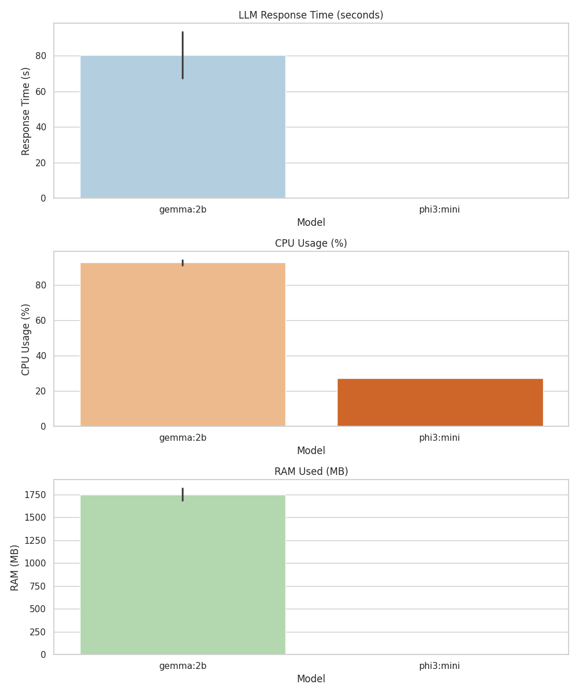
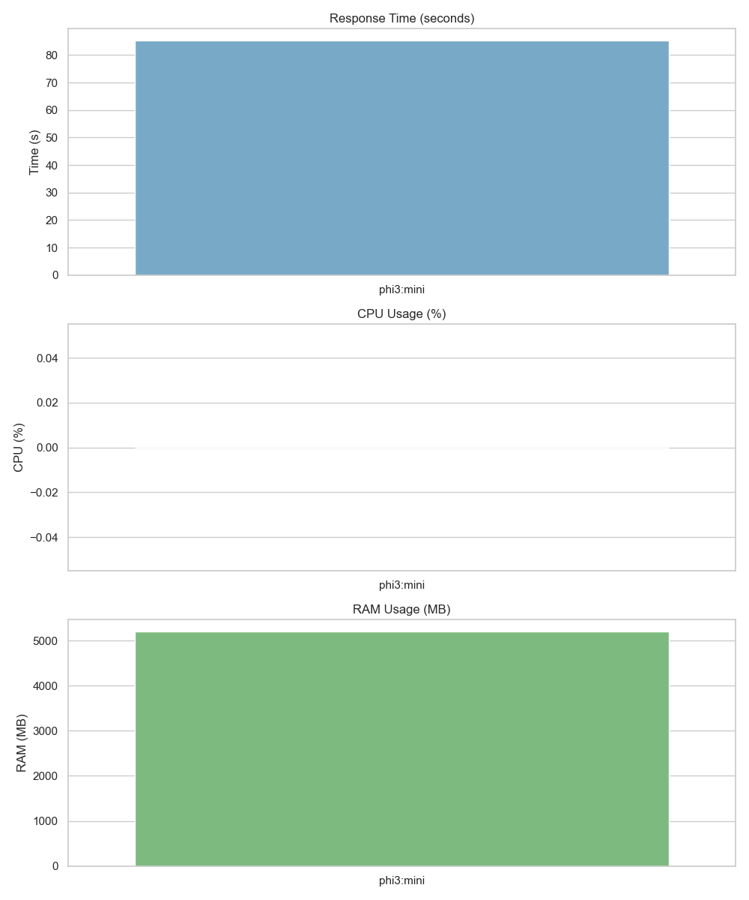
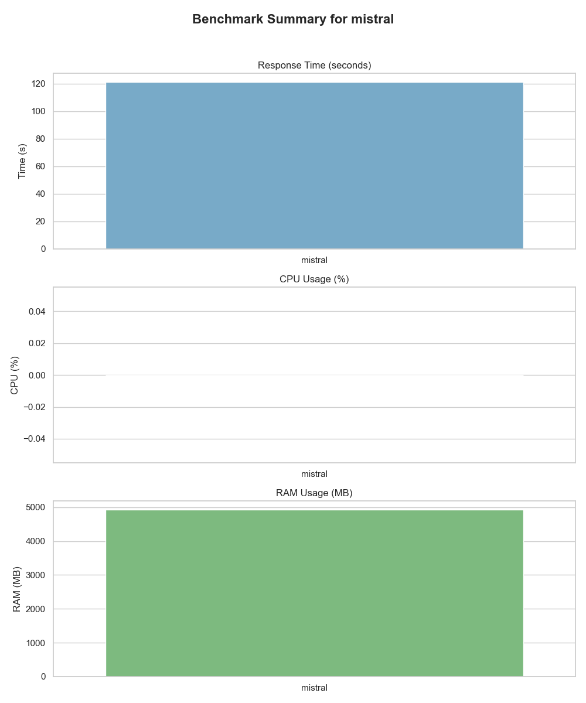
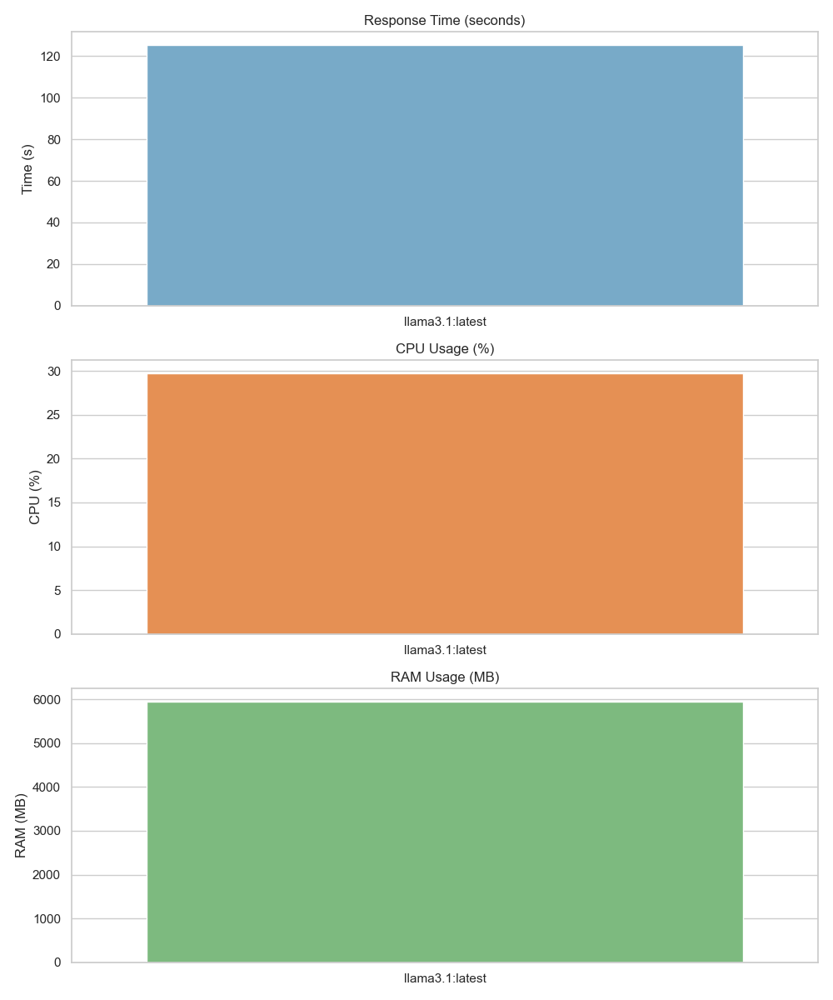
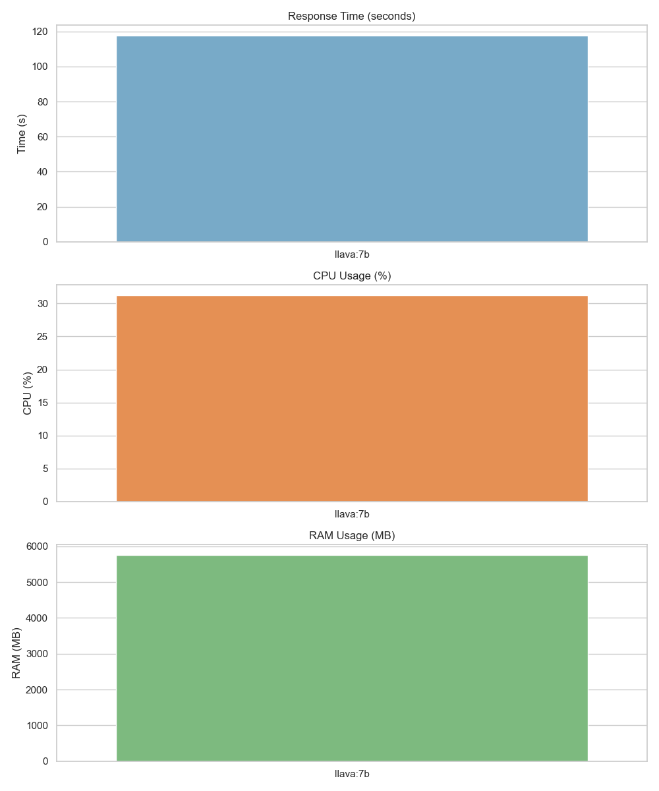
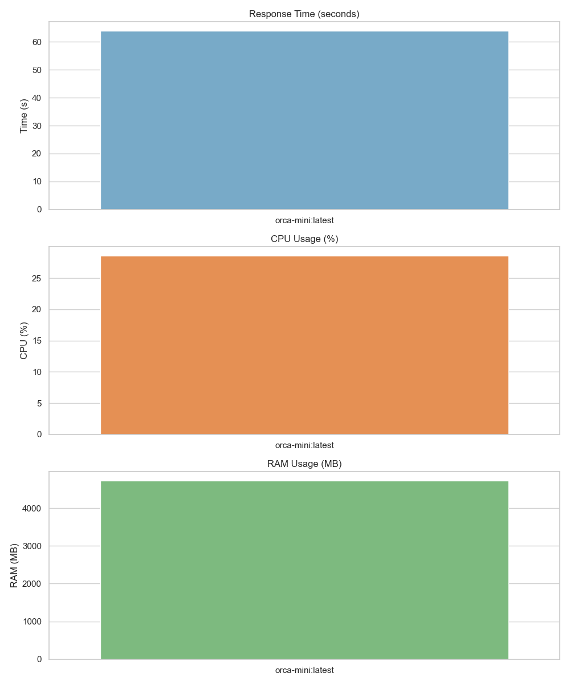
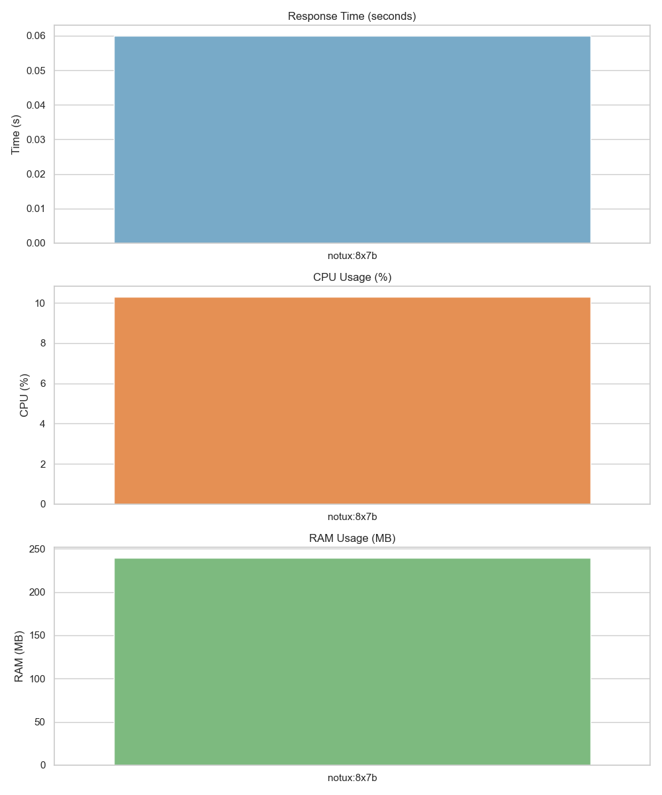
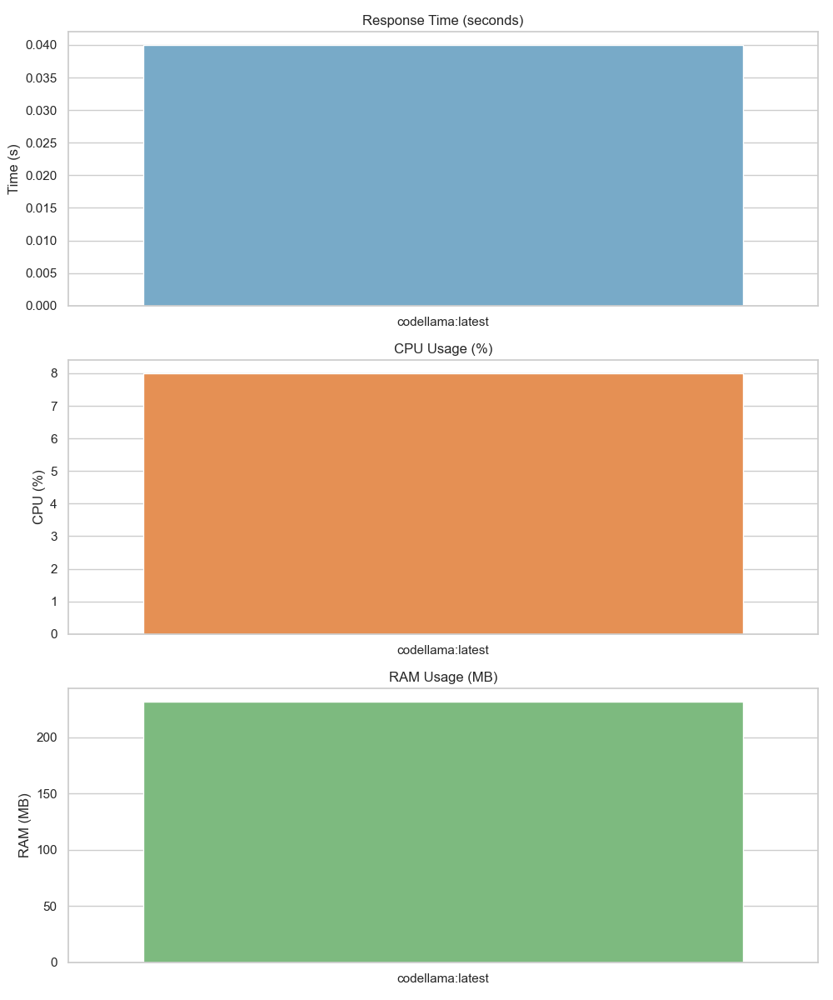

# Benchmark Visuals

This section presents visual summaries of benchmarking results for various language models and system tests. All plots are generated from data in `data/processed/`.

## Model Benchmark Visualizations
For each tested model, a summary plot is generated showing:
- **Response Time (seconds)**
- **CPU Usage (%)**
- **RAM Usage (MB)**

### Example Plots
- 
- 
- 
- 
- 
- 
- 
- 
- 

## Key Observations
- Larger models generally consume more RAM and CPU, and have longer response times.
- Quantized and distilled models offer significant efficiency gains.
- Model selection should balance performance needs and hardware constraints.

## Next Steps
- Benchmark additional models and quantization levels.
- Explore hardware acceleration (e.g., GPU, NPU).
- Analyze power consumption for sustained workloads.

---
