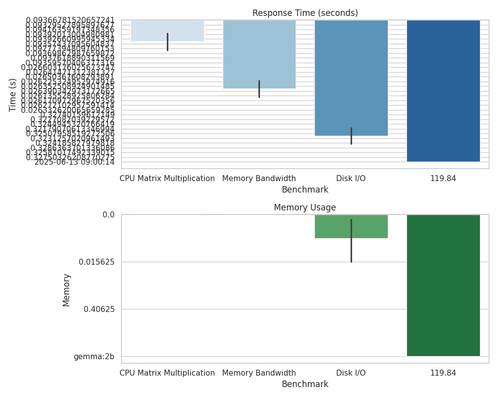

docs/05_Benchmark_V#  Benchmark Visuals

These plots show how different Ollama models perform on Raspberry Pi hardware.

## Tested Models
- gemma:2b
- phi3:mini
- mistral
- tinyllama
- llama2:7b-chat

##  Metrics

##  Observations
- RAM and CPU increase with model size.
- Smaller models give faster responses.

##  Next Steps
- Try quantized versions (if available).
- Explore performance with hardware accelerators.
- Analyze power consumption for sustained operations.

---
